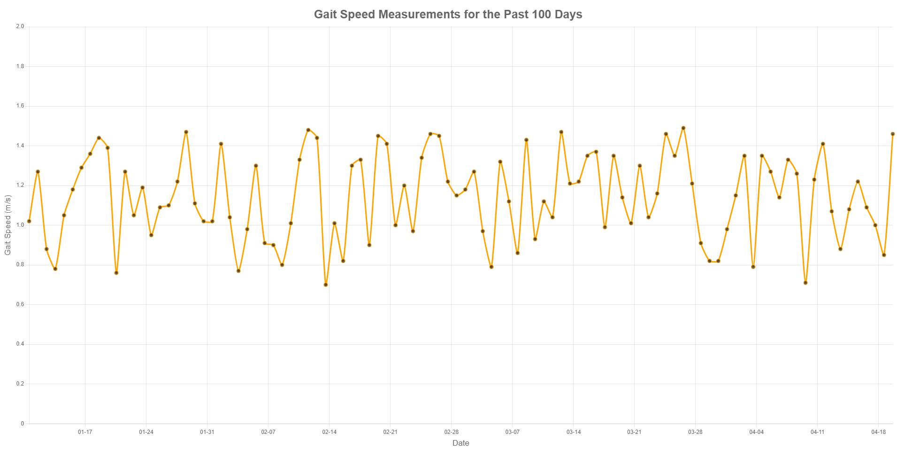

## About The Project
This is a visualization tool built for CS 4605 at Georgia Tech.



### Built With
* Python 3.9.2
* Django 3.1.7


## Getting Started
To get a local copy up and running follow these steps.

### Prerequisites
* Python 3.9.2

### Installation
1. Clone the repo
    ```sh
    git clone git@github.com:brendenwaits/gait-speed-visualizer.git
    ```

2. Change into the directory
    ```sh
    cd gait-speed-visualizer
    ```

3. Install neccesary Python packages
    ```sh
    python -m pip install -r requirements.txt
    ```

4. Create the database
    ```sh
    python manage.py migrate --run-syncdb
    ```


## Usage
1. Start the server
    ```sh
    python manage.py runserver
    ```

### Adding your own data
1. Open http://localhost:8000/api/gaitmeasurements/ in a browser of your choice

2. From there you can manually add data, or you can just POST data with HTTP

3. Go to http://localhost:8000/ to view the visualization

### Adding test data
1. Open a new terminal and run the dummy script
    ```sh
    python dummy.py
    ```
